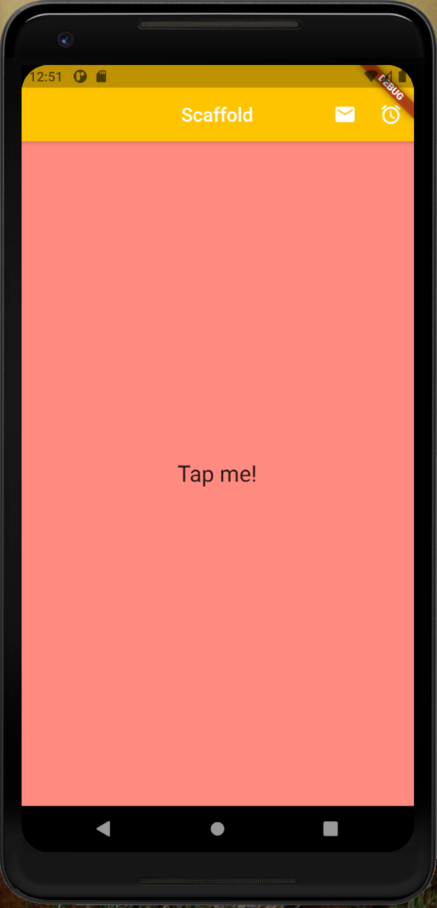

# first_scaffold

## Instructions

- Create project
- Create stateless widget with:
    appBar with Text centered and buttons (email and alarm)
    backGround color (amberAccent)
    on the body put a InkWell with Text and onTap event (debugPrint)

## Documentation

https://api.flutter.dev/flutter/material/InkWell-class.html
https://api.flutter.dev/flutter/material/IconButton-class.html
https://api.flutter.dev/flutter/widgets/Container-class.html
https://api.flutter.dev/flutter/widgets/Column-class.html
