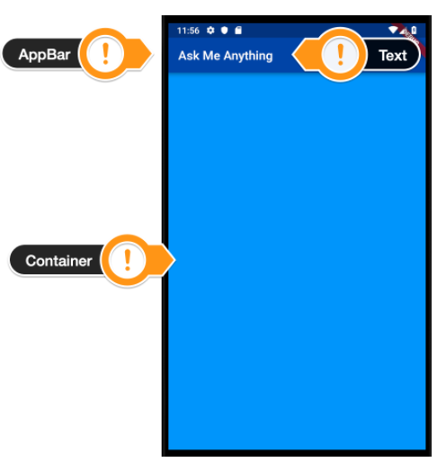
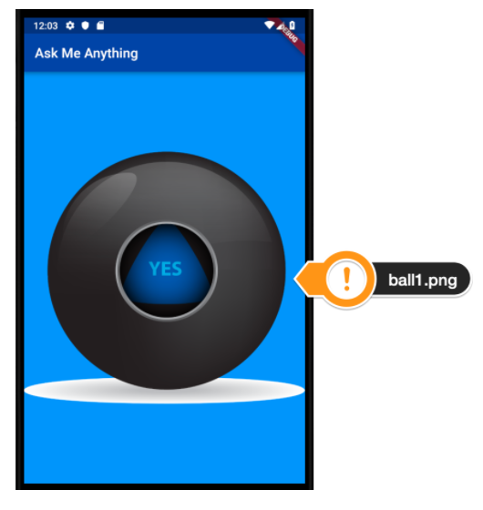

# magic_8_ball

- Create Flutter app magic_8_ball
- Create a Stateless Widget -> HomeUI
- Fix (comment or delete) tests
- Add MaterialApp into runApp call and replace home attribute with HomeUI instance
- HomeUI might have a Scaffold with AppBar and empty Container as a body
- Wireframe

- Create images folder and add images from files folder
- Reference images folder in pubspec.yaml
- Replace Container with a statefull widget -> BallUI
- Add ball1.png as show bellow:

- Use a TextButton to make image clickable (tip: replace Container by TextButton)
- Use print method to show a message on console when click on image
- Inside _BallUIState create a variable ballNumber and initialize with 0
- Use the variable ballNumber to select one of 5 images randomically. Import dart:math and use Random class and nextInt method

